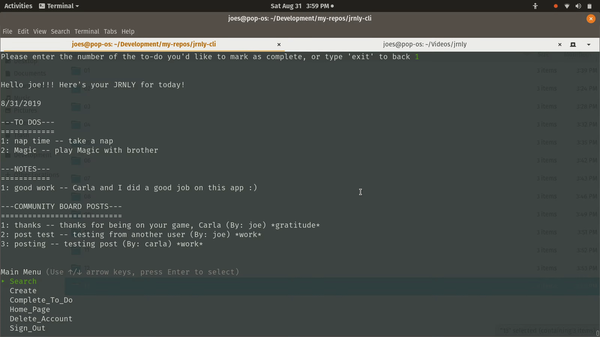

# JRNLY

* *Jrnly* is a command line CRUD application that allows users on a local environment to keep track of their `notes` and `to-do` list, as well as communicate with other users through `posts`. All `notes`, `posts` and `to-dos` are `tagged` by the user. `Tags` are topics that `notes`, `posts` and `to-dos` can share, so the user can look them up according to topic.

* To run *Jrnly*, open this file's directory in your terminal and type ruby bin/run.rb

* As noted above, *Jrnly* stores three types of data:

  - `Notes` are any thoughts the user wants to right down that are private and ought to be preserved. They are wiped from the user's home page each day

  - `To-dos` are like notes in that they are private, but they are not wiped from the user's home page until the user marks them complete. Any to-dos that are not marked complete by day-end roll over to the following day.

  - `Posts` are like notes in that they are wiped from the user's home page each day, except that they are public. They're displayed on the user's `community board` with their corresponding authors and `tags`.

* A *Jrnly* entry is the sectioned list of all notes and posts for the present day, as well as any to-dos not yet complete.

## More demos

* User interaction occurs primarily through posts phase in development

* New users can create an account and password

* Users can delete their accounts

* Login validations indicate errors in user input during login

* Searching data by date is not yet functional

* Users can search associated data by tag

* Users can view their notes separately from `to-dos` and `posts`

* Users can view all the tags that they and other users have labeled data with

* Users can mark `to-dos` complete, removing them from their `to-do` list

* Users can view the to-dos that they have completed

### Developed over the course of about five days by Carla Stickler and Joseph Syverson
#### May 2019 (our first app!)

https://github.com/joesyverson/jrnly-cli
